# 🩻 OASIS-AI

**End-to-End Deep Learning Platform for Medical Image Diagnosis**

[](#)
[](#)
[](#)
[](#)
[](#)
[](#)

---

OASIS-AI is an **end-to-end deep learning–powered diagnostic platform** built to assist healthcare professionals in reading chest X-rays. A **custom Convolutional Neural Network (CNN)**, trained from scratch, classifies uploaded scans (e.g. **Normal / Pneumonia / COVID-19**), and the Flask web application wraps that model in a full workflow — upload, inference, report generation, and result history — backed by a persistent database.

> ⚠️ **Disclaimer:** OASIS-AI is a research/portfolio project intended to demonstrate an ML-powered clinical-assist workflow. It is **not** a certified diagnostic tool and should not be used for real medical decision-making.

## ✨ Key Features

| Feature | Description |
|---|---|
| **Custom CNN Classifier** | A convolutional network built and trained from scratch (no transfer learning) on chest X-ray images to distinguish between disease classes |
| **End-to-End Web Pipeline** | Flask backend takes an uploaded X-ray straight through preprocessing → inference → report, with no manual steps in between |
| **Clinical Report Generation** | Model predictions are converted into a structured, human-readable diagnostic report for the clinician |
| **Persistent Patient/Prediction Records** | SQLAlchemy models + Alembic migrations (`migrations/`) track schema changes; results are stored for later retrieval rather than being one-off |
| **Server-Side Session Management** | `flask_session/` handles session state so user/report context survives across requests |
| **Batch Prediction Export** | `predictions.csv` shows the platform supports exporting/logging predictions in bulk, not just single-image inference |
| **Training Diagnostics Included** | `training_metrics.png`, `training_results.png`, and `test_results.png` document the model's training curves and evaluation performance |
| **Modular Route Structure** | `routes/` separates concerns (e.g. upload, prediction, report, auth) instead of a single monolithic app file |
| **Packaged Model & Backend** | `Model.zip`, `backend.zip`, and `scripts.zip` bundle the trained weights, server code, and supporting scripts for portable deployment |

## 🏗️ Architecture

```mermaid
graph LR
    A["🖼️ X-ray Upload<br/><small>Web UI</small>"] --> B["🧹 Preprocessing<br/><small>resize · normalize</small>"]
    B --> C["🧠 Custom CNN<br/><small>trained from scratch</small>"]
    C --> D["🏷️ Classification<br/><small>Normal / Pneumonia / COVID-19</small>"]
    D --> E["📄 Report Generator<br/><small>clinical summary</small>"]
    E --> F["🗄️ Database<br/><small>SQLAlchemy + Alembic</small>"]
    F --> G["📊 Dashboard / History<br/><small>Flask templates</small>"]

    style A fill:#06b6d422,stroke:#06b6d4,color:#e2e8f0
    style B fill:#eab30822,stroke:#eab308,color:#e2e8f0
    style C fill:#ef444422,stroke:#ef4444,color:#e2e8f0
    style D fill:#22c55e22,stroke:#22c55e,color:#e2e8f0
    style E fill:#7c3aed22,stroke:#7c3aed,color:#e2e8f0
    style F fill:#3b82f622,stroke:#3b82f6,color:#e2e8f0
    style G fill:#06b6d422,stroke:#06b6d4,color:#e2e8f0
```



### Model Workflow

1. **Upload** — A user (clinician) uploads a chest X-ray image through the web interface (`templates/` + `static/`).
2. **Preprocessing** — The image is resized, normalized, and converted into the tensor format the CNN expects.
3. **Inference** — The custom CNN (packaged in `Model.zip`) runs a forward pass and outputs class probabilities.
4. **Classification** — The highest-probability class (e.g. *Normal*, *Pneumonia*, *COVID-19*) is selected as the prediction, alongside its confidence score.
5. **Report Generation** — The prediction is formatted into a clinical-style report for the end user.
6. **Persistence** — The image reference, prediction, and report are written to the database via SQLAlchemy models, versioned through Alembic (`migrations/`).
7. **Review** — Results are served back through Flask routes (`routes/`) and rendered in the dashboard/history views, with session state maintained via `flask_session/`.

> 📊 *Training/evaluation curves and the confusion matrix produced during model development are included as `training_metrics.png`, `training_results.png`, and `test_results.png` in the repo root — worth embedding directly in this README (see below) once finalized.*

## 📂 Project Structure

```
Oasis-AI-/
├── routes/               # Flask route blueprints (upload, predict, report, auth, etc.)
├── templates/            # Jinja2 HTML templates for the web UI
├── static/               # CSS/JS/image assets for the frontend
├── instance/             # Instance-specific config / local SQLite DB (Flask instance folder)
├── migrations/           # Alembic migration scripts (SQLAlchemy schema versioning)
├── flask_session/        # Server-side session storage
├── Model.zip             # Packaged trained CNN weights + model-loading code
├── backend.zip           # Packaged backend/server code for deployment
├── scripts.zip           # Supporting scripts (training / preprocessing / utilities)
├── predictions.csv       # Logged/exported batch prediction results
├── python                # Entry point script for running the application
├── training_metrics.png  # Training loss/accuracy curves
├── training_results.png  # Training run summary/visualization
├── test_results.png      # Evaluation results on the test set
└── README.md
```

## 🚀 Quick Start

### Prerequisites

- **Python 3.x**
- `pip` for dependency installation
- The contents of `Model.zip`, `backend.zip`, and `scripts.zip` extracted locally

### Installation

```bash
# 1. Clone the repository
git clone https://github.com/Yaseen-2004/Oasis-AI-.git
cd Oasis-AI-

# 2. Extract the packaged model/backend/scripts
unzip Model.zip -d Model
unzip backend.zip -d backend
unzip scripts.zip -d scripts

# 3. Create and activate a virtual environment
python -m venv venv
# Windows:
venv\Scripts\activate
# macOS/Linux:
source venv/bin/activate

# 4. Install dependencies
pip install -r requirements.txt
```

> ℹ️ *Add a `requirements.txt` (Flask, SQLAlchemy, Flask-Migrate, Flask-Session, TensorFlow/PyTorch, Pillow, NumPy, etc.) if one isn't already tracked — it isn't currently visible at the repo root.*

### Set Up the Database

```bash
# Initialize / apply Alembic migrations
flask db upgrade
```

### Run the App

```bash
python python   # or the actual app entry point, e.g. app.py / run.py
```

Then open `http://localhost:5000` in your browser, upload a chest X-ray, and view the generated diagnostic report.

## 🛠️ Tech Stack

| Component | Technology | Purpose |
|---|---|---|
| **Model** | Custom CNN (built & trained from scratch) | Chest X-ray classification (Normal / Pneumonia / COVID-19) |
| **Backend** | Flask | Web server, routing, request handling |
| **Database ORM** | SQLAlchemy | Persisting patients, uploads, and predictions |
| **Migrations** | Alembic (via Flask-Migrate) | Versioned schema changes (`migrations/`) |
| **Session Management** | Flask-Session | Server-side session storage (`flask_session/`) |
| **Frontend** | Jinja2 templates + static CSS/JS | Upload UI, dashboard, report views |
| **Templating Engine** | Mako | Used by Alembic for migration script generation |
| **Batch Output** | CSV export | `predictions.csv` for bulk prediction logging |

## 📊 Model Performance

The repo includes training/evaluation artifacts (`training_metrics.png`, `training_results.png`, `test_results.png`). Once you have final numbers, drop them in here, e.g.:

| Metric | Value |
|---|---|
| Training Accuracy | _add from training_metrics.png_ |
| Validation Accuracy | _add from training_results.png_ |
| Test Accuracy | _add from test_results.png_ |
| Precision / Recall / F1 | _add per-class if available_ |

## 🔮 Roadmap & Future Improvements

- [ ] Add a tracked `requirements.txt` / `environment.yml` at the repo root
- [ ] Un-zip and commit `Model.zip` / `backend.zip` / `scripts.zip` as normal tracked source (or use Git LFS for weights)
- [ ] Embed the training/test result images directly in this README with actual accuracy numbers
- [ ] Add support for additional modalities (CT, MRI) alongside chest X-ray
- [ ] Add unit/regression tests for the inference pipeline
- [ ] Containerize with Docker for one-command deployment
- [ ] Add authentication/roles for clinician vs. admin access
- [ ] Add a REST API layer (in addition to the HTML UI) for programmatic access to predictions

## 📜 License

No license file is currently present in this repository — add one (e.g. MIT) if you intend for others to reuse this code...

---

Built with Flask, SQLAlchemy, and a custom-trained CNN.
